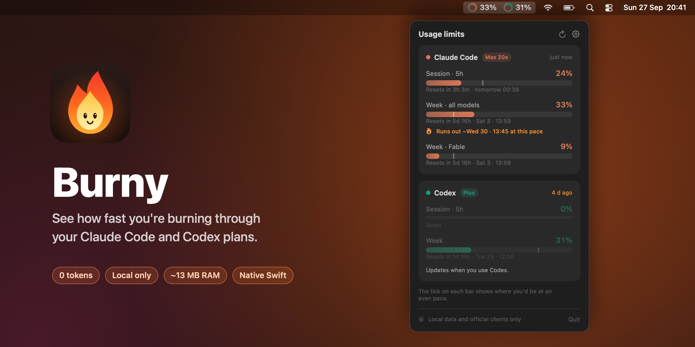
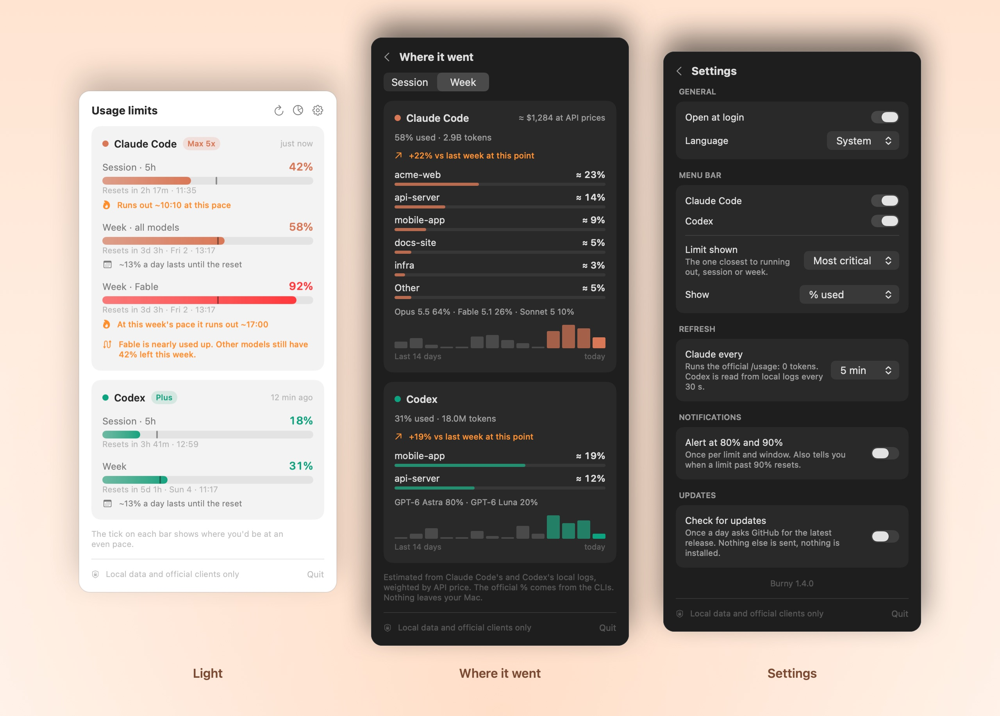

<p align="center">
  
</p>

<p align="center">
  <a href="https://github.com/giacolaiacomo/burny/actions/workflows/build.yml"></a>
  
  
  
  
  
</p>

# Burny

**See how fast you're burning through your AI plan.** Burny sits in your menu bar and shows how much of your Claude Code and Codex limits you've used, and whether you're going too fast.

<p align="center">
  
</p>

## Features

- **Every limit your plan has.** Claude Code: 5-hour session, weekly (all models) and per-model weekly buckets such as Fable. Codex: 5-hour session and weekly.
- **Glanceable menu bar.** App icon plus the limit closest to running out, turning orange at 75% and red at 90%.
- **Pace marker.** The tick on each bar shows where you'd be if you spread usage evenly across the window. Ahead of the tick means you're burning fast.
- **Burn forecast.** It says when a limit runs out, but only when that's likely. Sessions use the last 30 minutes and look one hour ahead ("Runs out ~18:40 at this pace"). Weeks use the average since the window opened and name the day ("At this week's pace it runs out ~Friday"). The rules were tuned by replaying ten weeks of real usage.
- **Reset countdowns.** "Resets in 4h 12m · 00:40" for every window.
- **Alerts** at 80% and 90% (optional), once per limit and window, plus a "you're good to go" alert when a limit you'd nearly used up resets.
- **Daily budget.** On weekly limits: how much you can use per day and still last until the reset.
- **Model switch hint.** When a per-model bucket such as Fable is nearly used up while other models still have room.
- **Where it went.** Splits your session and week by project and by model, using the token counts Claude Code and Codex already log on your Mac, e.g. "≈ 15% my-app, ≈ 7% website". Also shows a 14-day chart, the change against last week at the same point, and what the same usage would cost at API prices.
- **Settings.** Open at login, show or hide each service, choose which limit the bar shows and how (% used, % left, time to reset or icon only), refresh interval, alerts, update check, and English or Italian.
- **Tiny.** One Swift file with no dependencies: ~290 KB binary, ~13 MB RAM, 0% CPU at idle.

## Install

You need macOS 13+ and the Swift toolchain (`xcode-select --install`).

```sh
git clone https://github.com/giacolaiacomo/burny.git
cd burny
./install.sh
```

This builds `~/Applications/Burny.app` and registers it to start at login. To remove it: `./uninstall.sh`.

## How it gets the data, and why it's safe

Burny **never contacts Anthropic or OpenAI itself, never reads tokens or passwords, and never spends your quota.** Its only possible network request is the optional update check (off by default), which asks GitHub for the latest Burny release once a day.

| | Source | How often |
|---|---|---|
| **Claude Code** | Runs the official CLI's local `/usage` command: the model is never called, so it costs 0 tokens and $0. The binary's Anthropic signature is checked first, and the call runs with no tools, no MCP servers, no hooks and sandboxed away from your personal folders. | Every 5 min (configurable) and when you open the popover |
| **Breakdown** | Adds up the token counts in Claude Code's and Codex's own local logs. Only numbers, model names and project folder names are kept. | Only while the breakdown page is open |
| **Codex** | Reads the `rate_limits` the Codex CLI already writes to `~/.codex/sessions/`. It only reads the tail of the newest log, in small chunks. | Every 30 s, local disk only |

Because it only uses the vendors' own clients and files they already write on your Mac, nothing looks different to Anthropic or OpenAI than you using their tools normally. The Claude plan badge (Pro / Max) is read from `~/.claude.json`. See [SECURITY.md](SECURITY.md) for the full picture.

## Requirements

- **Claude Code**: `claude` installed and signed in with a subscription. Burny looks in `~/.local/bin`, `/opt/homebrew/bin` and `/usr/local/bin`.
- **Codex**: the Codex CLI or app, used at least once.
- The menu bar shows the icons of your locally installed Claude and ChatGPT apps if they're in `/Applications`, otherwise a coloured ring.

## Limitations

- Codex numbers are as fresh as your last Codex response, because Codex only logs them when you use it.
- ChatGPT chat message limits aren't stored locally, so they aren't shown. Getting them would mean scraping the website with your session, which is exactly what Burny avoids.
- The breakdown is an estimate. Anthropic and OpenAI don't publish how each token counts toward a plan's limits, so Burny weights tokens by API list price and scales the split to the official %.
- The popover's wording follows the Claude CLI's `/usage` output. If a future CLI changes that format, the Claude card may go empty until Burny is updated.

## Development

```sh
swiftc -Osize Sources/main.swift -o /tmp/burny
/tmp/burny --self-test                      # parser and forecast checks (also run in CI)
/tmp/burny --snapshot out.png dark en     # render the popover (add: settings or breakdown, it)
/tmp/burny --usage-log 7                    # print the per-project split of the last 7 days
/tmp/burny --icon icon.png 1024           # render the app icon
./scripts/screenshots.sh                    # regenerate the README images from your live limits
```

Adding a language means adding a string table next to `italian` in `Sources/main.swift`.

## Disclaimer

Burny is an independent project, not affiliated with or endorsed by Anthropic or OpenAI. Claude and Claude Code are trademarks of Anthropic, PBC; ChatGPT and Codex are trademarks of OpenAI.

## License

[MIT](LICENSE)
